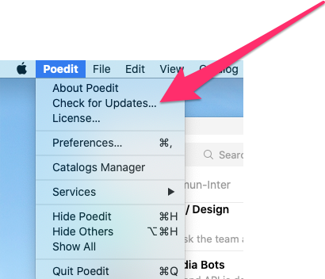

  

    <b>Everipedia Langauges</b>

## ✏️ Edit Instructions

1. Install [poedit](https://poedit.net/) or if you already have it, update to the latest version always

2. Clone this repository or [download it as a zip](https://github.com/EveripediaNetwork/everipedia-languages/archive/master.zip) then unzip. **Always pull the latest master before creating your branch**
3. Edit and save the translations with poedit
4. Push your changes to a branch other than `master`.
5. [Open a pull-request](https://github.com/EveripediaNetwork/everipedia-languages/compare) with the changes
